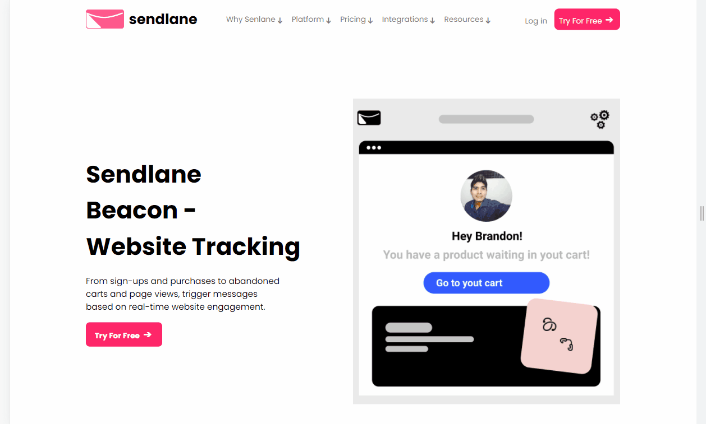

<h1 align="center">
  Landing page - Sendlane
</h1>

⚠️ Projeto em construção (muito no inicio)⚠️

 
 

<h2 align="center" style="color: blue">Descrição do projeto</h2>

Engatinhando na landing page - Sendlane, a imagem construi diretamente no figma, ainda irei fazer diversas features e animações, é um layout que irá ficar muito legal.

## Features:
- [x] Responsivo
- [x] Dropdown
- [ ] Menu mobile
- [ ] Navegação por Tab
- [ ] Scroll Suave
- [ ] Accordion 
 
 

## 🚀 Tecnologias usadas:
### HTML
### CSS
### JAVASCRIPT

 

## Ver na web
<a href="https://sendlane.netlify.app/" target="_blank">Sendlane</a>

 
 

Feito com muito ❤️ por Brandon Carlos

